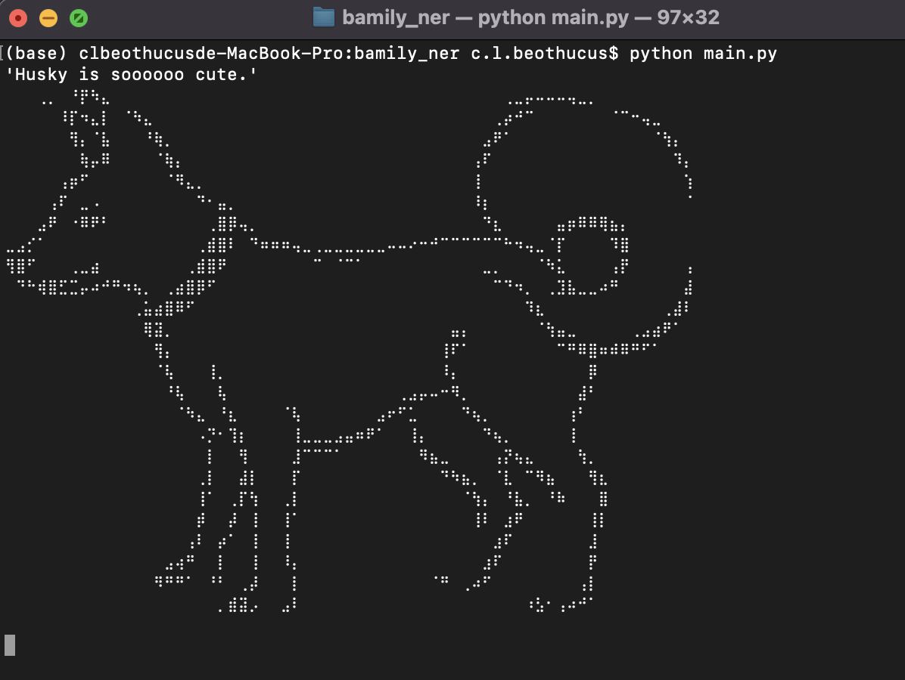
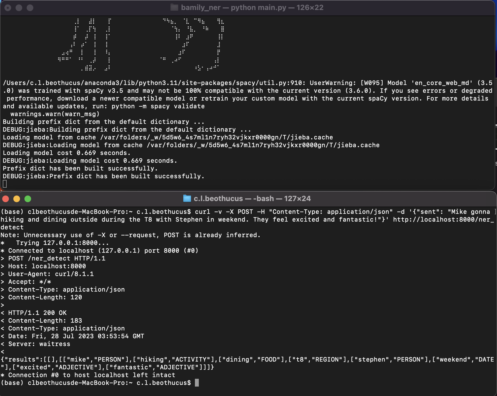
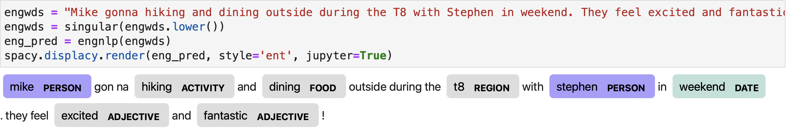
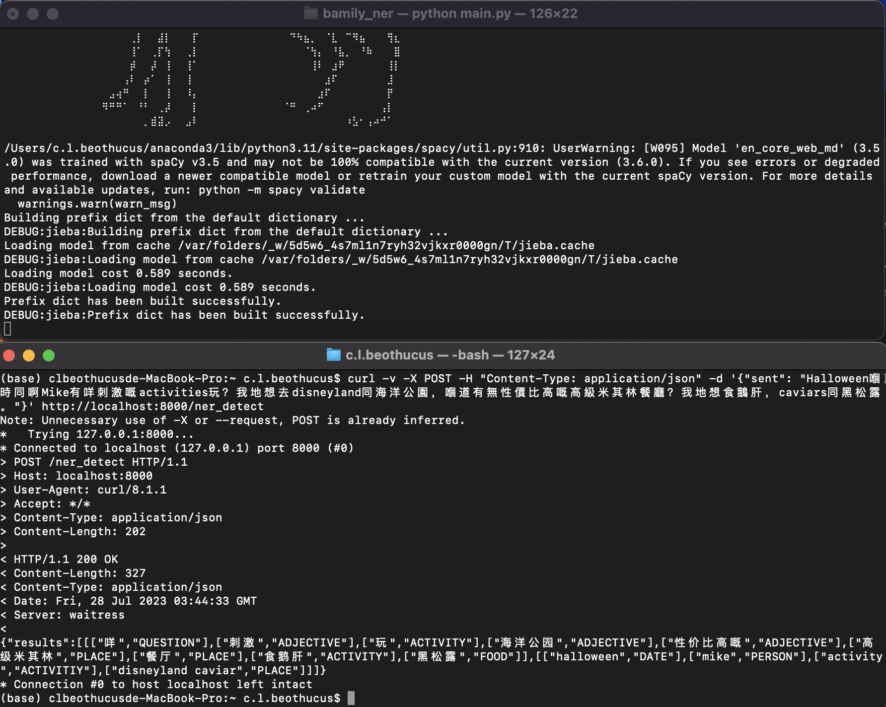
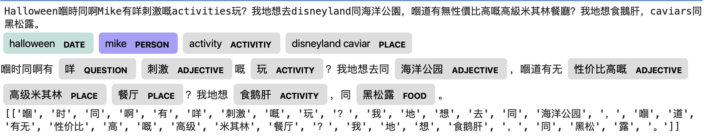

# :smiley_cat: Bamily_NER
The NER models is mainly trained using a popular open-source NLP library **[Spacy](https://spacy.io)**  It contains two models, one is for detect English entities another is for Simplified Chinese. The dataset is labelled using **[NER Annotator](https://tecoholic.github.io/ner-annotator/)**

## Get Started (NER)
It is recommended to make a **[new virtual environment](https://towardsdatascience.com/manage-your-python-virtual-environment-with-conda-a0d2934d5195)** with **Python 3.8** and install the dependencies. Following steps
can be taken to download and run the NER and Faiss server on local.
### Clone the repository
```
git clone https://github.com/kycompany/bamily-find-similar-food2/tree/master
```
### Change the branch to 'ner'
### Install required packages
This provided requirements.txt file consists the essential packages to install. Use the following command.
```
cd bamily-find-similar-food2
pip install -r requirements.txt
```
### Run the Server and make the NER detection
Type the first command to run the 'waitress' server for Flask. \n
Open a new terminal window to type the second command for making the prediction of {"sent": "..."}.
```
python NER_server.py
```


Open a new terminal window to type the second command for making the prediction of {"sent": "..."}.
### Demo
- Example 1:
```
curl -v -X POST -H "Content-Type: application/json" -d '{"sent": "Mike gonna hiking and dining outside during the T8 with Stephen in weekend. They feel excited and fantastic!"}' http://localhost:8000/ner_detect
```




- Example 2:
```
curl -v -X POST -H "Content-Type: application/json" -d '{"sent": "Halloween嗰時同啊Mike有咩刺激嘅activities玩？我地想去disneyland同海洋公園，嗰道有無性價比高嘅高級米其林餐廳？我地想食鵝肝，caviars同黑松露。"}' http://localhost:8000/ner_detect
```

